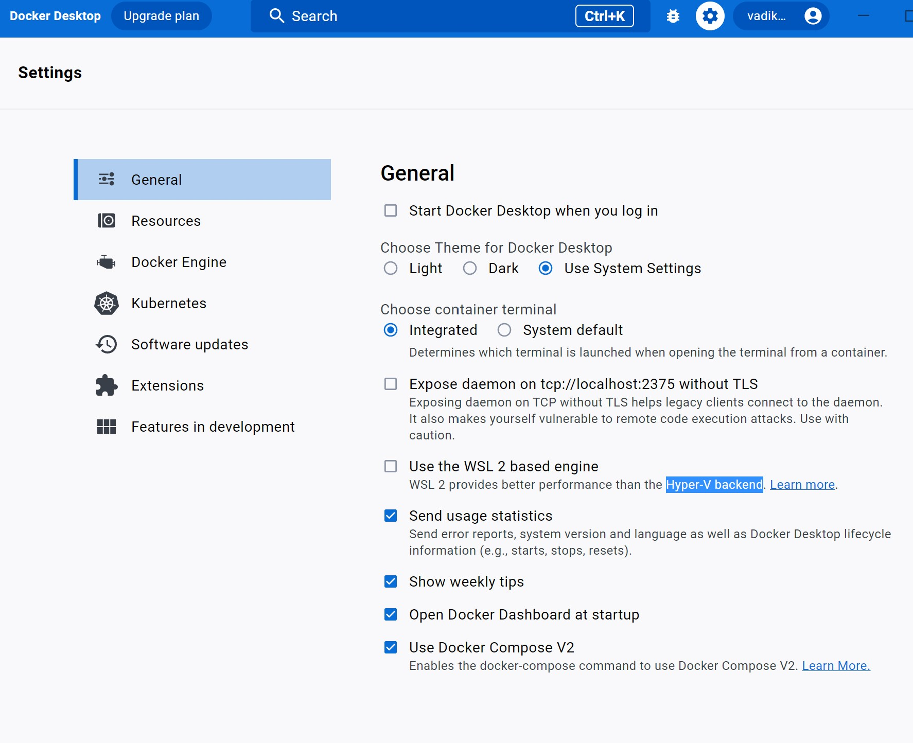

# Home Library Service

## Prerequisites

- Git - [Download & Install Git](https://git-scm.com/downloads).
- Node.js - [Download & Install Node.js](https://nodejs.org/en/download/) and the npm package manager.
- Docker [Dowload & Install Docker](https://www.docker.com/)

## Downloading

```
git clone https://github.com/vadim-mg/nodejs2022Q4-service
```

## Installing NPM modules
Go to the project directory, change branch and install all dependencies

```
git checkout feat-docker-prisma
npm install
```

## Running application in Docker (recommended)
1. copy env.example to .env !!!
2. and setup variables if you need
3. start docker on your machine, and then run:

```
docker compose up --build
```

4. Wait while install will be complete, and app say 
```
"Service started on Port:..."
```
5. You can use api. 
6. After starting the app on port (4000 as default) you can open
in your browser OpenAPI documentation by typing http://localhost:4000/doc/.
For more information about OpenAPI/Swagger please visit https://swagger.io/.


---
### Docker hotreload
Unfortunately on my machine (Win10 pro) hotreload works only when docker engine use Hyper-V backend settings:



I tryed use nodemon and wsl2, but it was too slowly :( I didn't want to develop with so environment. So I decided turn Hyper-V, and all worked fast :)
### Docker advanced
 Built images are pushed to DockerHub:

```
vadikm1981/library-service-db
vadikm1981/library-service-app
```

Implemented npm script for vulnerabilities scanning (free solution)
```
npm run docker:scan-app
npm run docker:scan-postgress
```


---
## Testing

After application running open new terminal and enter:

To run all tests without authorization

```
npm run test
```

To run only one of all test suites

```
npm run test -- <path to suite>
```

To run all test with authorization

```
npm run test:auth
```

To run only specific test suite with authorization

```
npm run test:auth -- <path to suite>
```

### Auto-fix and format

```
npm run lint
```

```
npm run format
```

### Debugging in VSCode

Press <kbd>F5</kbd> to debug.

For more information, visit: https://code.visualstudio.com/docs/editor/debugging


---
## Optional running application locally (for advanced user)

you need install postgress on your system and decide all problem self :)
```
npm start
```
After starting the app on port (4000 as default) you can open
in your browser OpenAPI documentation by typing http://localhost:4000/doc/.
For more information about OpenAPI/Swagger please visit https://swagger.io/.
